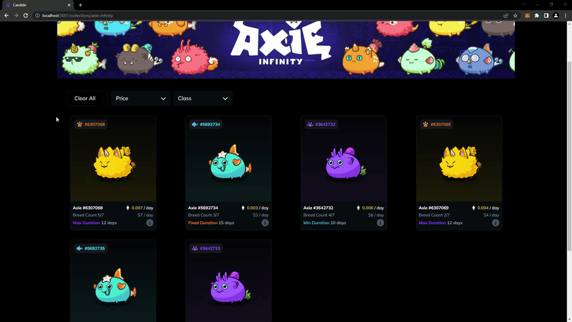

# Candide Marketplace

We're building an NFT rental marketplace for P2E games 🕹️

#### The marketplace is now in beta testing! 🚀

#### <a href="https://marketplace.candide.site/">marketplace.candide.site</a> ⚠️ site under active development ⚠️

 

## Table of Contents

- [About Candide](#about-candide)
- [The Front-end](#the-front-end)
  - [Technologies Used](#technologies-used)
  - [My Role](#my-role)
- [Features](#features-alpha-version)
  - [NFT Card & Details Page](#nft-card--details-page)
  - [Dynamic Popover Screen Containment](#dynamic-popover-screen-containment)
  - [NFT Sorting and Filtering](#nft-sorting-and-filtering)

 

## About Candide

### We are a small, international, team that is passionate about providing value to p2e players.

The Candide marketplace will allow users to rent p2e NFTs for their favorite NFT games.

- When renting an NFT you gain access to its utility without risking your capital
- When lending an NFT you put it to work generating passive income
   

### Come Say Hello 👋

[][discord]
[][linkedin]
[][twitter]
[][instagram]

 
 

## The Front-end

<!-- #### 🚨 The following images demonstrate features & functionality I built for the site. These demos are populated with static data and assets used in development and do not accurately represent the current state of the project. 🚨 -->

### Technologies Used:

- Nuxt/Vue 2
- Tailwind.css
- Assorted utility libraries (date-fns, js-cookie, fontawesome, etc.)
- **No front-end component libraries**

### My Role

I fill the role of sole designer & front-end engineer. I built the UI and all of the components from scratch using Tailwind.css.

<!--  -->

## Features (alpha version)

#### 🚨 The following images demonstrate features & functionality I built for the site. These demos are populated with static data and assets used in development and do not accurately represent the current state of the project. 🚨

### NFT Card & Details Page

All the components are dynamic and reusable. Each axie's stats and traits in the popover and on the details page are dynamically selected and styled based on the data passed into the components.

 

### Dynamic Popover Screen Containment

1. The popover is "staged" for display when the mouse enters the
   border of the card component. - `display: none;` is swapted for `display: flex;` & `opacity: 0;`

2. At this point `getBoundingClientRect()` is used to get the appropriate coordinates of the popover and the containing window.

3. If the coordinates of the popover excede the limit of the window then the position of the popover is altered to be within the appropriate boundaries.

4. The "i" icon is hovered and the popover transitions into view using `opacity` and `scale`

5. Reverse steps for fade-out and "unstaging" of the popover.

 

### NFT Sorting and Filtering

[twitter]: https://twitter.com/CandideNft
[instagram]: https://www.instagram.com/candidenft/
[linkedin]: https://www.linkedin.com/company/candidenft/
[discord]: https://discord.com/channels/1000021187600076810/1000021854058205224
