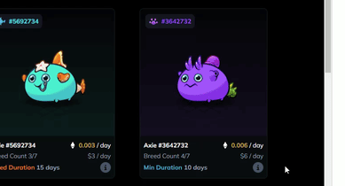
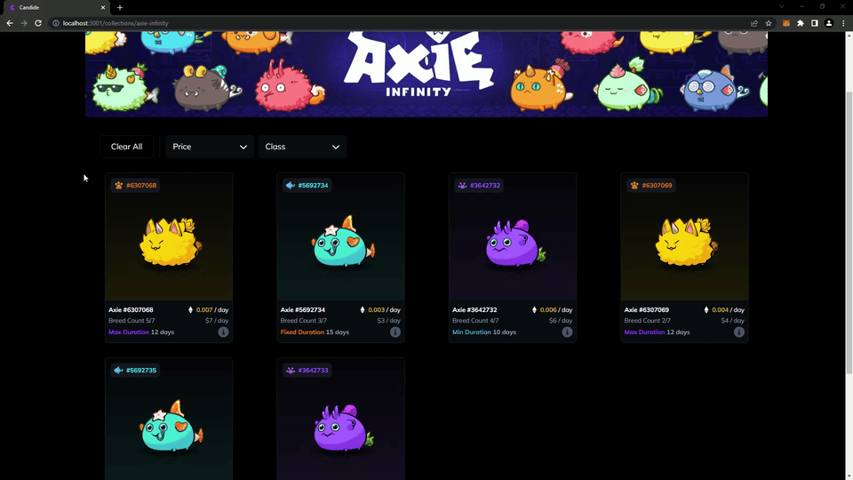
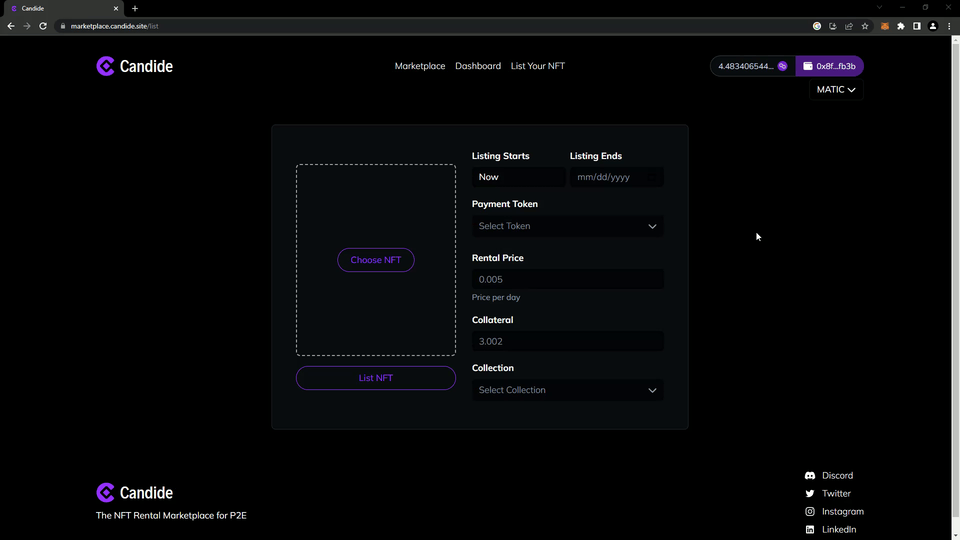

# Candide Marketplace

We're building an NFT rental marketplace for P2E games 🕹️

#### The marketplace is now in beta testing! 🚀

#### <a href="https://marketplace.candide.site/">marketplace.candide.site</a> 🛒
⚠️ site under active development ⚠️

## Table of Contents

- [About Candide](#about-candide)
- [The Front-end](#the-front-end)
  - [Technologies Used](#technologies-used)
  - [My Role](#my-role)
  - [Media](#media)
- [Features](#features-alpha-version)
  - [NFT Card & Details Page](#nft-card--details-page)
  - [Dynamic Popover Screen Containment](#dynamic-popover-screen-containment)
  - [Sorting and Filtering](#sorting-and-filtering-tools)
  - [Form & Validation](#form-and-validation)

 

## About Candide

### We are a small, international, team that is passionate about providing value to p2e players.

The Candide marketplace will allow users to rent p2e NFTs for their favorite NFT games.

- When renting an NFT you gain access to its utility without risking your capital
- When lending an NFT you put it to work generating passive income
   

#### Come Say Hello 👋

[][discord]
[][linkedin]
[][twitter]
[][instagram]

 
 
 

## The Front-end

### Technologies Used:

- Nuxt/Vue 2
- Tailwind
- Assorted utility libraries (date-fns, js-cookie, fontawesome, etc.)
- **No front-end component libraries**

### My Role

I fill the role of sole designer & front-end engineer. I built the UI and all of the components from scratch.

### Media

A video walkthrough of Candide's site and beta test process.
 

🟣 Note: the video is in french
 

[Back to top](#candide-marketplace)

 

## Features (alpha version)

#### 🚨 The following images demonstrate features & functionality I built for the site. These demos are populated with static data and assets used in development and may not accurately represent the current state of the project. 🚨

### NFT Card & Details Page

- All the components are dynamic and reusable
- Each axie's stats, traits, and icons, in both the popover and on the details page, are dynamically selected and styled.

[Back to top](#candide-marketplace)

### Dynamic Popover Screen Containment

1. The popover is "staged" for display when the mouse enters the
   border of the card component i.e. `display: none` exchanged for `display: flex`

2. `getBoundingClientRect` is used to get the appropriate coordinates of the popover and the containing window

3. If the coordinates of the popover exceed the limit of the window then the position of the popover is adjusted to be within the appropriate boundaries

4. The `🛈` icon is hovered and the popover transitions into view using `opacity` and `scale`

5. Reverse steps for fade-out and "unstaging" of the popover

[Back to top](#candide-marketplace)

### Sorting and Filtering Tools

- Custom select box components built from scratch along with filter chips which display all filters currently being applied
- Active filters are displayed both in the filter chip row and also as highlighted options within each select box
- When a filter is deleted (which can originate from four different user actions) All relevant components are updated to reflect the change

[Back to top](#candide-marketplace)

### Form and Validation

- Custom from components and validation built from scratch
- Error messages prompt the user to enter valid information
- Form state prevents an incomplete form from being submitted.

[Back to top](#candide-marketplace)

[twitter]: https://twitter.com/CandideNft
[instagram]: https://www.instagram.com/candidenft/
[linkedin]: https://www.linkedin.com/company/candidenft/
[discord]: https://discord.com/channels/1000021187600076810/1000021854058205224
